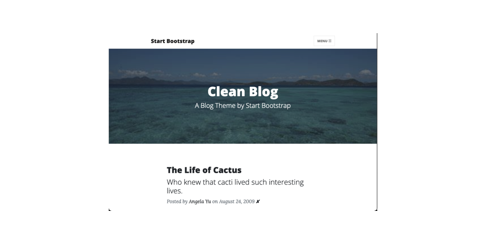

# RESTful Routing Blog with Editing and a SQLite database.
- 👋 Hi, I’m @WilliamSpanfelner
- 👀 I’m interested in using Python with Swift in iOS environments and why it may or may not be desirable.
- 🌱 I’m currently learning Python with the London App Brewery and Angela Yu's [100 Days of Code: 
The Complete Python Pro Bootcamp for 2022](https://www.udemy.com/course/100-days-of-code/) on Udemy.  
- 🧑‍💻 The previous blog site from Day 59 with an SQLite data base and a proper text editor for posting and updating entries, and a facility for deleting entries. Note: Be sure to update required packages should operational error occur.
- 💞️ I’m looking to collaborate on application development.
- 📫 How to reach me...

[//]: # ([![email]&#40;https://img.shields.io/badge/email-wil--1--am%40outlook.com-grey?style=plastic&#41;]&#40;mailto:wil-1-am@outlook.com&#41;)

